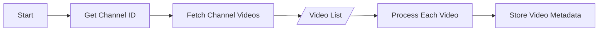
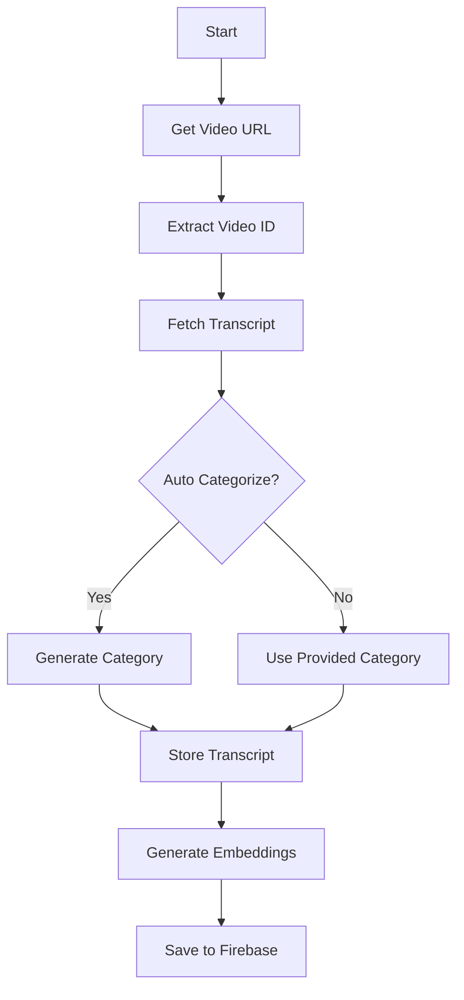
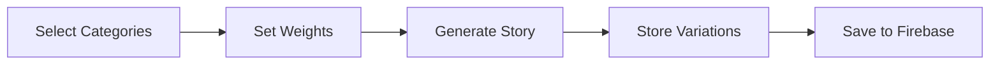
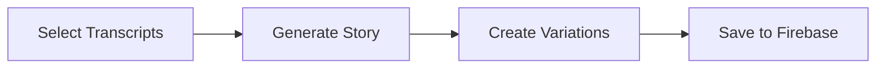
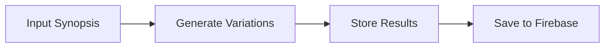

# Application Flow Documentation

## System Overview

This application transforms YouTube content into stories through a series of steps involving transcript extraction, processing, and AI-powered story generation. Here's a detailed breakdown of the system flow:

## 1. YouTube Content Collection

### Channel Content Retrieval



**Implementation Steps:**

1. Use the `/youtube/channel/{channel_id}/videos` endpoint
2. Parameters:
   - `channel_id`: Target YouTube channel
   - `max_results`: Number of videos (1-50)
   - `order`: Sort order (date, viewCount, rating)
3. Response includes video IDs, titles, publish dates, and thumbnails

## 2. Transcript Processing

### Individual Video Processing



**Implementation Steps:**

1. Use `/transcripts/process` endpoint
2. Required parameters:
   - `url`: YouTube video URL
   - `category` (optional)
   - `auto_categorize` (default: true)
3. System will:
   - Extract video ID
   - Fetch transcript
   - Auto-categorize content if enabled
   - Store in Firebase with embeddings

## 3. Story Generation

### From Category Weights



**Implementation Flow:**

1. Use `/generate/story` endpoint
2. Request body includes:

   ```json
   {
     "category_weights": [
       {"name": "category1", "weight": 0.7},
       {"name": "category2", "weight": 0.3}
     ],
     "variations_count": 3,
     "style": "professional",
     "material_per_category": 5,
     "length": 500
   }
   ```

3. System generates multiple story variations based on weighted categories

### From Specific Transcripts



**Implementation Flow:**

1. Use `/generate/story-from-transcripts` endpoint
2. Request body includes:

   ```json
   {
     "transcript_ids": ["id1", "id2"],
     "variations_count": 3,
     "style": "professional",
     "length": 500
   }
   ```

3. System generates stories using specific transcripts

### From Synopsis



**Implementation Flow:**

1. Use `/generate/story-from-synopsis` endpoint
2. Request body includes:

   ```json
   {
     "story": "synopsis text",
     "variations_count": 3,
     "style": "professional",
     "length": 500
   }
   ```

3. System generates variations based on synopsis

## Frontend Implementation Guide

### Key UI Components Needed

1. **Channel Input Section**
   - Channel ID input field
   - Video listing display
   - Processing status indicators

2. **Transcript Management**
   - Video URL input
   - Category selection/creation
   - Auto-categorization toggle
   - Transcript display/preview

3. **Story Generation Interface**

   ```jsx
   // Example structure
   const StoryGenerator = () => {
     const [categories, setCategories] = useState([]);
     const [weights, setWeights] = useState([]);
     const [style, setStyle] = useState('professional');
     const [length, setLength] = useState(500);
     
     // Implementation logic
   }
   ```

4. **Story Management Dashboard**
   - Story listing
   - Edit/Delete functionality
   - Synopsis creation interface
   - Variation display

### Recommended Data Flow

1. **Initial Load**

   ```javascript
   // Fetch categories
   GET /categories/

   // Fetch existing stories
   GET /stories/
   ```

2. **Content Processing**

   ```javascript
   // Process new video
   POST /transcripts/process
   
   // Monitor status and update UI
   GET /transcripts/{video_id}
   ```

3. **Story Generation**

   ```javascript
   // Generate from categories
   POST /generate/story
   
   // Generate from transcripts
   POST /generate/story-from-transcripts
   
   // Generate from synopsis
   POST /generate/story-from-synopsis
   ```

### Error Handling

1. Implement error boundaries for API calls
2. Handle common error scenarios:
   - Invalid YouTube URLs
   - Missing transcripts
   - Generation failures
   - Network issues

### State Management Considerations

1. Track processing status for long-running operations
2. Cache frequently accessed data (categories, recent stories)
3. Implement optimistic updates for better UX
4. Consider using state management libraries (Redux, Zustand)

### User Experience Notes

1. Implement loading states for all async operations
2. Provide clear feedback for processing status
3. Allow for batch operations where possible
4. Implement preview functionality for generated content
5. Enable quick access to recent/favorite content

## Firebase Integration Notes

### Collection Structure

```
/transcripts_[category]/
  - Transcript documents
/stories/
  - Story documents
/categories/
  - Category documents
```

### Real-time Updates

Consider implementing real-time listeners for:

1. Story generation status
2. Transcript processing status
3. Category updates

This comprehensive flow allows for a scalable system that can process YouTube content into various story formats while maintaining organization through categories and providing multiple generation options.
